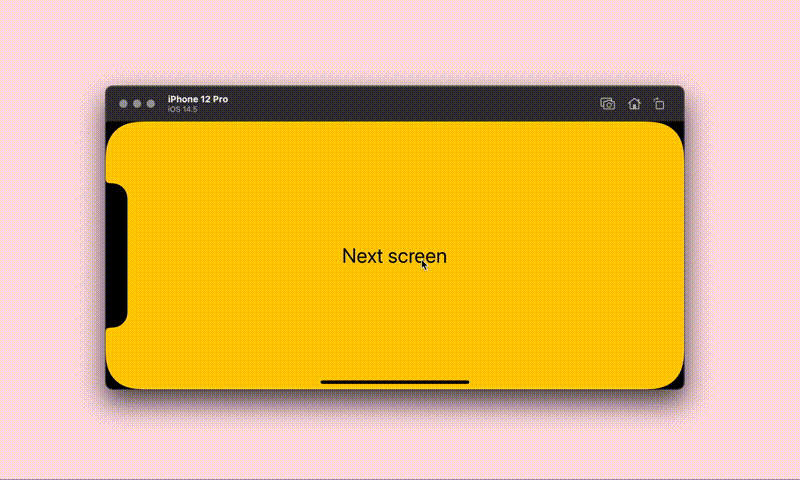

# Animating routes

On a platform like iOS, users may expect animated screen transitions when navigating through the app. (Less so the case with macOS) Apps get these transitions for free with `NavigationView`. But with SwiftUI Router, however, this is not the case. Ideally, you want a transition that differs as the user goes forward (deeper) in the app and when they go back (higher).

SwiftUI Router exposes the `Navigator` environment object. An object that allows for navigation done programmatically. It also contains the property `.lastAction`, which is of type `NavigationAction?`. This object contains read-only information about the last navigation that occurred. Information like the previous path, the current path, whether the app navigated forward or back. But also the *direction* of the navigation, which is what we're interested in right now.

The *direction* of a navigation action implies whether the app navigated deeper, higher or sideways in the routing hierarchy. Consider an app user currently being on the news screen (`/news`) and they press an article. The user navigates from `/news` to `/news/some-article`. This is labeled as **deeper**. The user scrolls to the bottom and presses a related news article (`/news/related-article`). This is labeled as **sideways**. Finally, when the user goes back to the news screen (`/news`), the direction is **higher**.

We can use this information to decide how our views are animated as the user navigates through your app.

Below an example of a very primitive `ViewModifier` that animates routes similar to views in a `NavigationView`:

```swift
struct NavigationTransition: ViewModifier {
	@EnvironmentObject private var navigator: Navigator
	
	func body(content: Content) -> some View {
		content
			.animation(.easeInOut)
			.transition(
				navigator.lastAction?.direction == .deeper || navigator.lastAction?.direction == .sideways
					? AnyTransition.asymmetric(insertion: .move(edge: .trailing), removal: .move(edge: .leading))
					: AnyTransition.asymmetric(insertion: .move(edge: .leading), removal: .move(edge: .trailing))
			)
	}
}
```
When the user navigates either deeper or sideways in the routing hierarchy, the new view enters the screen from the right, whereas the previous view leaves the screen on the left. However, when the user navigates higher in the routing hierarchy (e.g.: pressing the back button), the transitions are reversed.

To make the view modifier more accessible and user-friendlier, consider wrapping it in a View method like any other modifier:

```swift
extension View {
	func navigationTransition() -> some View {
		modifier(NavigationTransition())
	}
}
```

The modifier can be applied to `Route` views:
```swift
Route(path: "news") {
	NewsScreen()
}
.navigationTransition()
```

The modifier can also be applied to a `SwitchRoutes`. This will apply the animated transition to all `Route` views inside the `SwitchRoutes`.
```swift
SwitchRoutes {
	Route(path: "news/:id", validator: newsIdValidator) { uuid in
		NewsItemScreen(uuid: uuid)
	}
	Route(path: "news") {
		NewsScreen()
	}
	Route {
		HomeScreen()
	}
}
.navigationTransition()
```

*Tada~*


